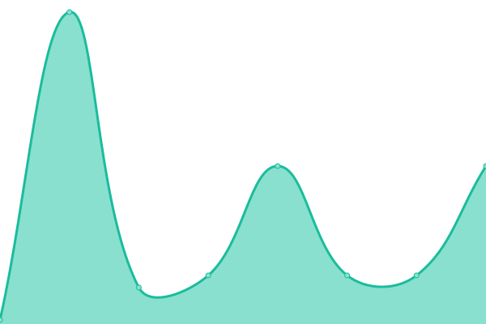

# [📈 Live Status](https://status.forwardemail.net): <!--live status--> **🟧 Partial outage**

This repository contains the open-source uptime monitor and status page for [Forward Email - Free, Encrypted, and Open-Source Email Forwarding Service for Custom Domains](https://forwardemail.net), powered by [Upptime](https://github.com/upptime/upptime).

With [Upptime](https://upptime.js.org), you can get your own unlimited and free uptime monitor and status page, powered entirely by a GitHub repository. We use [Issues](https://github.com/forwardemail/status.forwardemail.net/issues) as incident reports, [Actions](https://github.com/forwardemail/status.forwardemail.net/actions) as uptime monitors, and [Pages](https://status.forwardemail.net) for the status page.

<!--start: status pages-->
<!-- This summary is generated by Upptime (https://github.com/upptime/upptime) -->
<!-- Do not edit this manually, your changes will be overwritten -->
<!-- prettier-ignore -->
| URL | Status | History | Response Time | Uptime |
| --- | ------ | ------- | ------------- | ------ |
|  [forwardemail.net](https://forwardemail.net) | 🟩 Up | [forwardemail-net.yml](https://github.com/forwardemail/status.forwardemail.net/commits/HEAD/history/forwardemail-net.yml) | 

 158ms
     
 | 

<a href="https://status.forwardemail.net/history/forwardemail-net">100.00%</a>
    

|  [web-vu-sj-ca (forwardemail.net - Vultr - San Jose, California, USA)](https://45.63.88.165) | 🟩 Up | [web-vu-sj-ca-forwardemail-net-vultr-san-jose-california-usa.yml](https://github.com/forwardemail/status.forwardemail.net/commits/HEAD/history/web-vu-sj-ca-forwardemail-net-vultr-san-jose-california-usa.yml) | 

 677ms
     
 | 

<a href="https://status.forwardemail.net/history/web-vu-sj-ca-forwardemail-net-vultr-san-jose-california-usa">100.00%</a>
    

|  [web-do-am-nl (forwardemail.net - Digital Ocean - Amsterdam, Netherlands, Europe)](https://159.223.238.2) | 🟩 Up | [web-do-am-nl-forwardemail-net-digital-ocean-amsterdam-netherlands-europe.yml](https://github.com/forwardemail/status.forwardemail.net/commits/HEAD/history/web-do-am-nl-forwardemail-net-digital-ocean-amsterdam-netherlands-europe.yml) | 

 1807ms
     
 | 

<a href="https://status.forwardemail.net/history/web-do-am-nl-forwardemail-net-digital-ocean-amsterdam-netherlands-europe">100.00%</a>
    

|  [api.forwardemail.net](https://api.forwardemail.net) | 🟥 Down | [api-forwardemail-net.yml](https://github.com/forwardemail/status.forwardemail.net/commits/HEAD/history/api-forwardemail-net.yml) | 

 176ms
     
 | 

<a href="https://status.forwardemail.net/history/api-forwardemail-net">96.95%</a>
    

|  [api-vu-sj-ca (api.forwardemail.net - Vultr - San Jose, California, USA)](https://149.28.198.68) | 🟥 Down | [api-vu-sj-ca-api-forwardemail-net-vultr-san-jose-california-usa.yml](https://github.com/forwardemail/status.forwardemail.net/commits/HEAD/history/api-vu-sj-ca-api-forwardemail-net-vultr-san-jose-california-usa.yml) | 

 290ms
     
 | 

<a href="https://status.forwardemail.net/history/api-vu-sj-ca-api-forwardemail-net-vultr-san-jose-california-usa">100.00%</a>
    

|  [api-do-am-nl (api.forwardemail.net - Digital Ocean - Amsterdam, Netherlands, Europe)](https://164.92.213.75) | 🟩 Up | [api-do-am-nl-api-forwardemail-net-digital-ocean-amsterdam-netherlands-europe.yml](https://github.com/forwardemail/status.forwardemail.net/commits/HEAD/history/api-do-am-nl-api-forwardemail-net-digital-ocean-amsterdam-netherlands-europe.yml) | 

 426ms
     
 | 

<a href="https://status.forwardemail.net/history/api-do-am-nl-api-forwardemail-net-digital-ocean-amsterdam-netherlands-europe">100.00%</a>
    

|  [mx1.forwardemail.net](mx1.forwardemail.net) | 🟩 Up | [mx1-forwardemail-net.yml](https://github.com/forwardemail/status.forwardemail.net/commits/HEAD/history/mx1-forwardemail-net.yml) | 

 76ms
     
 | 

<a href="https://status.forwardemail.net/history/mx1-forwardemail-net">100.00%</a>
    

|  [mx2.forwardemail.net](mx2.forwardemail.net) | 🟩 Up | [mx2-forwardemail-net.yml](https://github.com/forwardemail/status.forwardemail.net/commits/HEAD/history/mx2-forwardemail-net.yml) | 

 36ms
     
 | 

<a href="https://status.forwardemail.net/history/mx2-forwardemail-net">100.00%</a>
    

|  bree | 🟩 Up | [bree.yml](https://github.com/forwardemail/status.forwardemail.net/commits/HEAD/history/bree.yml) | 

 28ms
     
 | 

<a href="https://status.forwardemail.net/history/bree">100.00%</a>
    

|  mongo | 🟩 Up | [mongo.yml](https://github.com/forwardemail/status.forwardemail.net/commits/HEAD/history/mongo.yml) | 

 47ms
     
 | 

<a href="https://status.forwardemail.net/history/mongo">100.00%</a>
    

|  redis | 🟩 Up | [redis.yml](https://github.com/forwardemail/status.forwardemail.net/commits/HEAD/history/redis.yml) | 

 22ms
     
 | 

<a href="https://status.forwardemail.net/history/redis">100.00%</a>
    

<!--end: status pages-->

[**Visit our status website →**](https://status.forwardemail.net)

## 📄 License

- Powered by: [Upptime](https://github.com/upptime/upptime)
- Code: [MIT](./LICENSE) © [Forward Email - Free, Encrypted, and Open-Source Email Forwarding Service for Custom Domains](https://forwardemail.net)
- Data in the `./history` directory: [Open Database License](https://opendatacommons.org/licenses/odbl/1-0/)
