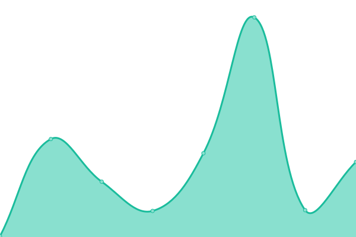

# [📈 Live Status](https://status.forwardemail.net): <!--live status--> **🟩 All systems operational**

This repository contains the open-source uptime monitor and status page for [Forward Email - Free, Encrypted, and Open-Source Email Forwarding Service for Custom Domains](https://forwardemail.net), powered by [Upptime](https://github.com/upptime/upptime).

With [Upptime](https://upptime.js.org), you can get your own unlimited and free uptime monitor and status page, powered entirely by a GitHub repository. We use [Issues](https://github.com/forwardemail/status.forwardemail.net/issues) as incident reports, [Actions](https://github.com/forwardemail/status.forwardemail.net/actions) as uptime monitors, and [Pages](https://status.forwardemail.net) for the status page.

<!--start: status pages-->
<!-- This summary is generated by Upptime (https://github.com/upptime/upptime) -->
<!-- Do not edit this manually, your changes will be overwritten -->
<!-- prettier-ignore -->
| URL | Status | History | Response Time | Uptime |
| --- | ------ | ------- | ------------- | ------ |
|  [forwardemail.net](https://forwardemail.net) | 🟩 Up | [forwardemail-net.yml](https://github.com/forwardemail/status.forwardemail.net/commits/HEAD/history/forwardemail-net.yml) | 

 1058ms
     
 | 

<a href="https://status.forwardemail.net/history/forwardemail-net">100.00%</a>
    

|  [api.forwardemail.net](https://api.forwardemail.net) | 🟩 Up | [api-forwardemail-net.yml](https://github.com/forwardemail/status.forwardemail.net/commits/HEAD/history/api-forwardemail-net.yml) | 

 443ms
     
 | 

<a href="https://status.forwardemail.net/history/api-forwardemail-net">100.00%</a>
    

|  [smtp.forwardemail.net (TLS)](smtp.forwardemail.net) | 🟩 Up | [smtp-forwardemail-net-tls.yml](https://github.com/forwardemail/status.forwardemail.net/commits/HEAD/history/smtp-forwardemail-net-tls.yml) | 

 95ms
     
 | 

<a href="https://status.forwardemail.net/history/smtp-forwardemail-net-tls">99.75%</a>
    

|  [smtp.forwardemail.net (SSL)](smtp.forwardemail.net) | 🟩 Up | [smtp-forwardemail-net-ssl.yml](https://github.com/forwardemail/status.forwardemail.net/commits/HEAD/history/smtp-forwardemail-net-ssl.yml) | 

 92ms
     
 | 

<a href="https://status.forwardemail.net/history/smtp-forwardemail-net-ssl">99.75%</a>
    

|  [imap.forwardemail.net (TLS)](imap.forwardemail.net) | 🟩 Up | [imap-forwardemail-net-tls.yml](https://github.com/forwardemail/status.forwardemail.net/commits/HEAD/history/imap-forwardemail-net-tls.yml) | 

 97ms
     
 | 

<a href="https://status.forwardemail.net/history/imap-forwardemail-net-tls">100.00%</a>
    

|  [pop3.forwardemail.net (TLS)](pop3.forwardemail.net) | 🟩 Up | [pop3-forwardemail-net-tls.yml](https://github.com/forwardemail/status.forwardemail.net/commits/HEAD/history/pop3-forwardemail-net-tls.yml) | 

 70ms
     
 | 

<a href="https://status.forwardemail.net/history/pop3-forwardemail-net-tls">100.00%</a>
    

|  [mx1.forwardemail.net](mx1.forwardemail.net) | 🟩 Up | [mx1-forwardemail-net.yml](https://github.com/forwardemail/status.forwardemail.net/commits/HEAD/history/mx1-forwardemail-net.yml) | 

 61ms
     
 | 

<a href="https://status.forwardemail.net/history/mx1-forwardemail-net">100.00%</a>
    

|  [mx2.forwardemail.net](mx2.forwardemail.net) | 🟩 Up | [mx2-forwardemail-net.yml](https://github.com/forwardemail/status.forwardemail.net/commits/HEAD/history/mx2-forwardemail-net.yml) | 

 39ms
     
 | 

<a href="https://status.forwardemail.net/history/mx2-forwardemail-net">100.00%</a>
    

|  [bree.forwardemail.net](bree.forwardemail.net) | 🟩 Up | [bree-forwardemail-net.yml](https://github.com/forwardemail/status.forwardemail.net/commits/HEAD/history/bree-forwardemail-net.yml) | 

 66ms
     
 | 

<a href="https://status.forwardemail.net/history/bree-forwardemail-net">100.00%</a>
    

|  [sqlite.forwardemail.net](sqlite.forwardemail.net) | 🟩 Up | [sqlite-forwardemail-net.yml](https://github.com/forwardemail/status.forwardemail.net/commits/HEAD/history/sqlite-forwardemail-net.yml) | 

 56ms
     
 | 

<a href="https://status.forwardemail.net/history/sqlite-forwardemail-net">100.00%</a>
    

<!--end: status pages-->

[**Visit our status website →**](https://status.forwardemail.net)

## 📄 License

- Powered by: [Upptime](https://github.com/upptime/upptime)
- Code: [MIT](./LICENSE) © [Forward Email - Free, Encrypted, and Open-Source Email Forwarding Service for Custom Domains](https://forwardemail.net)
- Data in the `./history` directory: [Open Database License](https://opendatacommons.org/licenses/odbl/1-0/)
