# [📈 Live Status](https://status.forwardemail.net): <!--live status--> **🟧 Partial outage**

This repository contains the open-source uptime monitor and status page for [Forward Email - Free, Encrypted, and Open-Source Email Forwarding Service for Custom Domains](https://forwardemail.net), powered by [Upptime](https://github.com/upptime/upptime).

With [Upptime](https://upptime.js.org), you can get your own unlimited and free uptime monitor and status page, powered entirely by a GitHub repository. We use [Issues](https://github.com/forwardemail/status.forwardemail.net/issues) as incident reports, [Actions](https://github.com/forwardemail/status.forwardemail.net/actions) as uptime monitors, and [Pages](https://status.forwardemail.net) for the status page.

<!--start: status pages-->
<!-- This summary is generated by Upptime (https://github.com/upptime/upptime) -->
<!-- Do not edit this manually, your changes will be overwritten -->
<!-- prettier-ignore -->
| URL | Status | History | Response Time | Uptime |
| --- | ------ | ------- | ------------- | ------ |
|  [https://forwardemail.net (curl)](https://forwardemail.net) | 🟩 Up | [https-forwardemail-net-curl.yml](https://github.com/forwardemail/status.forwardemail.net/commits/HEAD/history/https-forwardemail-net-curl.yml) | 

 457ms
     
 | 

<a href="https://status.forwardemail.net/history/https-forwardemail-net-curl">100.00%</a>
    

|  [forwardemail.net:443 (IPv4)](forwardemail.net) | 🟩 Up | [forwardemail-net-443-i-pv4.yml](https://github.com/forwardemail/status.forwardemail.net/commits/HEAD/history/forwardemail-net-443-i-pv4.yml) | 

 38ms
     
 | 

<a href="https://status.forwardemail.net/history/forwardemail-net-443-i-pv4">100.00%</a>
    

|  [forwardemail.net:443 (IPv6)](forwardemail.net) | 🟩 Up | [forwardemail-net-443-i-pv6.yml](https://github.com/forwardemail/status.forwardemail.net/commits/HEAD/history/forwardemail-net-443-i-pv6.yml) | 

 37ms
     
 | 

<a href="https://status.forwardemail.net/history/forwardemail-net-443-i-pv6">100.00%</a>
    

|  [forwardemail.net:80 (IPv4)](forwardemail.net) | 🟩 Up | [forwardemail-net-80-i-pv4.yml](https://github.com/forwardemail/status.forwardemail.net/commits/HEAD/history/forwardemail-net-80-i-pv4.yml) | 

 37ms
     
 | 

<a href="https://status.forwardemail.net/history/forwardemail-net-80-i-pv4">100.00%</a>
    

|  [forwardemail.net:80 (IPv6)](forwardemail.net) | 🟩 Up | [forwardemail-net-80-i-pv6.yml](https://github.com/forwardemail/status.forwardemail.net/commits/HEAD/history/forwardemail-net-80-i-pv6.yml) | 

 37ms
     
 | 

<a href="https://status.forwardemail.net/history/forwardemail-net-80-i-pv6">100.00%</a>
    

|  [https://api.forwardemail.net (curl)](https://api.forwardemail.net) | 🟩 Up | [https-api-forwardemail-net-curl.yml](https://github.com/forwardemail/status.forwardemail.net/commits/HEAD/history/https-api-forwardemail-net-curl.yml) | 

 245ms
     
 | 

<a href="https://status.forwardemail.net/history/https-api-forwardemail-net-curl">100.00%</a>
    

|  [api.forwardemail.net:443 (IPv4)](api.forwardemail.net) | 🟩 Up | [api-forwardemail-net-443-i-pv4.yml](https://github.com/forwardemail/status.forwardemail.net/commits/HEAD/history/api-forwardemail-net-443-i-pv4.yml) | 

 37ms
     
 | 

<a href="https://status.forwardemail.net/history/api-forwardemail-net-443-i-pv4">100.00%</a>
    

|  [api.forwardemail.net:443 (IPv6)](api.forwardemail.net) | 🟩 Up | [api-forwardemail-net-443-i-pv6.yml](https://github.com/forwardemail/status.forwardemail.net/commits/HEAD/history/api-forwardemail-net-443-i-pv6.yml) | 

 37ms
     
 | 

<a href="https://status.forwardemail.net/history/api-forwardemail-net-443-i-pv6">100.00%</a>
    

|  [api.forwardemail.net:80 (IPv4)](api.forwardemail.net) | 🟩 Up | [api-forwardemail-net-80-i-pv4.yml](https://github.com/forwardemail/status.forwardemail.net/commits/HEAD/history/api-forwardemail-net-80-i-pv4.yml) | 

 37ms
     
 | 

<a href="https://status.forwardemail.net/history/api-forwardemail-net-80-i-pv4">100.00%</a>
    

|  [api.forwardemail.net:80 (IPv6)](api.forwardemail.net) | 🟩 Up | [api-forwardemail-net-80-i-pv6.yml](https://github.com/forwardemail/status.forwardemail.net/commits/HEAD/history/api-forwardemail-net-80-i-pv6.yml) | 

 37ms
     
 | 

<a href="https://status.forwardemail.net/history/api-forwardemail-net-80-i-pv6">100.00%</a>
    

|  [smtp.forwardemail.net:587 (IPv4)](smtp.forwardemail.net) | 🟩 Up | [smtp-forwardemail-net-587-i-pv4.yml](https://github.com/forwardemail/status.forwardemail.net/commits/HEAD/history/smtp-forwardemail-net-587-i-pv4.yml) | 

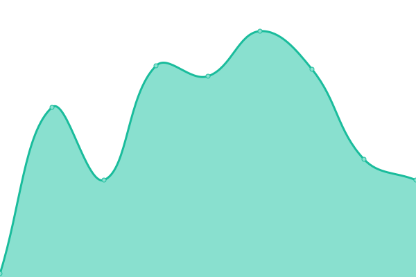 35ms
     
 | 

<a href="https://status.forwardemail.net/history/smtp-forwardemail-net-587-i-pv4">100.00%</a>
    

|  [smtp.forwardemail.net:587 (IPv6)](smtp.forwardemail.net) | 🟩 Up | [smtp-forwardemail-net-587-i-pv6.yml](https://github.com/forwardemail/status.forwardemail.net/commits/HEAD/history/smtp-forwardemail-net-587-i-pv6.yml) | 

 44ms
     
 | 

<a href="https://status.forwardemail.net/history/smtp-forwardemail-net-587-i-pv6">100.00%</a>
    

|  [smtp.forwardemail.net:2587 (IPv4)](smtp.forwardemail.net) | 🟩 Up | [smtp-forwardemail-net-2587-i-pv4.yml](https://github.com/forwardemail/status.forwardemail.net/commits/HEAD/history/smtp-forwardemail-net-2587-i-pv4.yml) | 

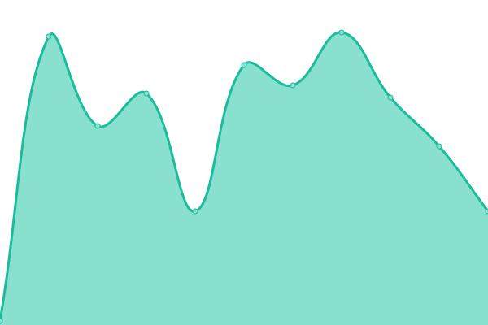 45ms
     
 | 

<a href="https://status.forwardemail.net/history/smtp-forwardemail-net-2587-i-pv4">100.00%</a>
    

|  [smtp.forwardemail.net:2587 (IPv6)](smtp.forwardemail.net) | 🟩 Up | [smtp-forwardemail-net-2587-i-pv6.yml](https://github.com/forwardemail/status.forwardemail.net/commits/HEAD/history/smtp-forwardemail-net-2587-i-pv6.yml) | 

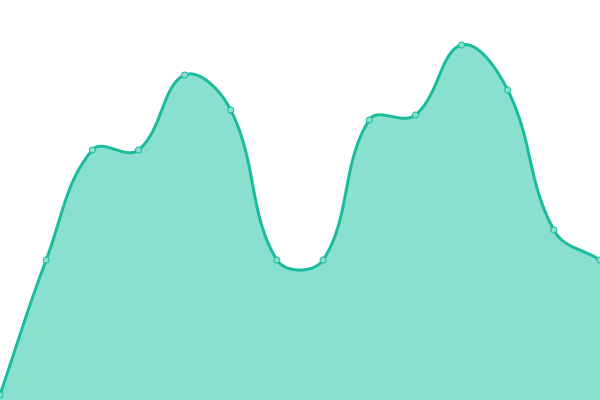 49ms
     
 | 

<a href="https://status.forwardemail.net/history/smtp-forwardemail-net-2587-i-pv6">100.00%</a>
    

|  [smtp.forwardemail.net:465 (IPv4)](smtp.forwardemail.net) | 🟩 Up | [smtp-forwardemail-net-465-i-pv4.yml](https://github.com/forwardemail/status.forwardemail.net/commits/HEAD/history/smtp-forwardemail-net-465-i-pv4.yml) | 

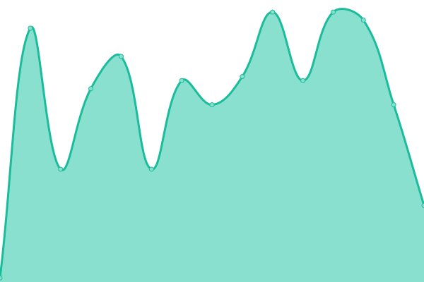 51ms
     
 | 

<a href="https://status.forwardemail.net/history/smtp-forwardemail-net-465-i-pv4">100.00%</a>
    

|  [smtp.forwardemail.net:465 (IPv6)](smtp.forwardemail.net) | 🟩 Up | [smtp-forwardemail-net-465-i-pv6.yml](https://github.com/forwardemail/status.forwardemail.net/commits/HEAD/history/smtp-forwardemail-net-465-i-pv6.yml) | 

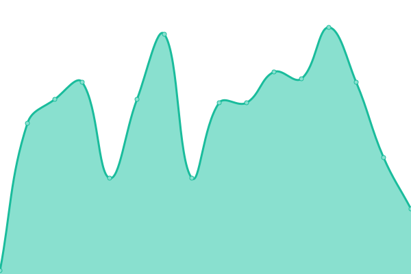 55ms
     
 | 

<a href="https://status.forwardemail.net/history/smtp-forwardemail-net-465-i-pv6">100.00%</a>
    

|  [smtp.forwardemail.net:2465 (IPv4)](smtp.forwardemail.net) | 🟩 Up | [smtp-forwardemail-net-2465-i-pv4.yml](https://github.com/forwardemail/status.forwardemail.net/commits/HEAD/history/smtp-forwardemail-net-2465-i-pv4.yml) | 

 44ms
     
 | 

<a href="https://status.forwardemail.net/history/smtp-forwardemail-net-2465-i-pv4">100.00%</a>
    

|  [smtp.forwardemail.net:2465 (IPv6)](smtp.forwardemail.net) | 🟩 Up | [smtp-forwardemail-net-2465-i-pv6.yml](https://github.com/forwardemail/status.forwardemail.net/commits/HEAD/history/smtp-forwardemail-net-2465-i-pv6.yml) | 

 51ms
     
 | 

<a href="https://status.forwardemail.net/history/smtp-forwardemail-net-2465-i-pv6">100.00%</a>
    

|  [smtp.forwardemail.net:25 (IPv4)](smtp.forwardemail.net) | 🟩 Up | [smtp-forwardemail-net-25-i-pv4.yml](https://github.com/forwardemail/status.forwardemail.net/commits/HEAD/history/smtp-forwardemail-net-25-i-pv4.yml) | 

 60ms
     
 | 

<a href="https://status.forwardemail.net/history/smtp-forwardemail-net-25-i-pv4">100.00%</a>
    

|  [smtp.forwardemail.net:25 (IPv6)](smtp.forwardemail.net) | 🟩 Up | [smtp-forwardemail-net-25-i-pv6.yml](https://github.com/forwardemail/status.forwardemail.net/commits/HEAD/history/smtp-forwardemail-net-25-i-pv6.yml) | 

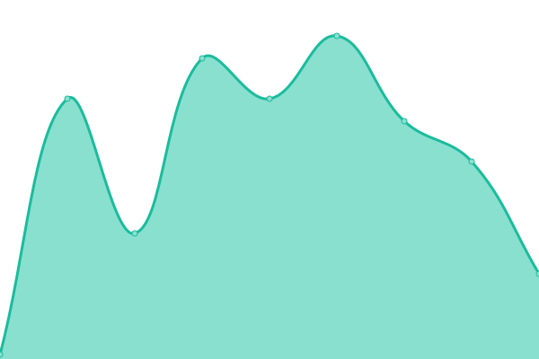 36ms
     
 | 

<a href="https://status.forwardemail.net/history/smtp-forwardemail-net-25-i-pv6">100.00%</a>
    

|  [smtp.forwardemail.net:2525 (IPv4)](smtp.forwardemail.net) | 🟩 Up | [smtp-forwardemail-net-2525-i-pv4.yml](https://github.com/forwardemail/status.forwardemail.net/commits/HEAD/history/smtp-forwardemail-net-2525-i-pv4.yml) | 

 84ms
     
 | 

<a href="https://status.forwardemail.net/history/smtp-forwardemail-net-2525-i-pv4">100.00%</a>
    

|  [smtp.forwardemail.net:2525 (IPv6)](smtp.forwardemail.net) | 🟩 Up | [smtp-forwardemail-net-2525-i-pv6.yml](https://github.com/forwardemail/status.forwardemail.net/commits/HEAD/history/smtp-forwardemail-net-2525-i-pv6.yml) | 

 38ms
     
 | 

<a href="https://status.forwardemail.net/history/smtp-forwardemail-net-2525-i-pv6">100.00%</a>
    

|  [imap.forwardemail.net:993 (IPv4)](imap.forwardemail.net) | 🟩 Up | [imap-forwardemail-net-993-i-pv4.yml](https://github.com/forwardemail/status.forwardemail.net/commits/HEAD/history/imap-forwardemail-net-993-i-pv4.yml) | 

 32ms
     
 | 

<a href="https://status.forwardemail.net/history/imap-forwardemail-net-993-i-pv4">99.73%</a>
    

|  [imap.forwardemail.net:993 (IPv6)](imap.forwardemail.net) | 🟩 Up | [imap-forwardemail-net-993-i-pv6.yml](https://github.com/forwardemail/status.forwardemail.net/commits/HEAD/history/imap-forwardemail-net-993-i-pv6.yml) | 

 32ms
     
 | 

<a href="https://status.forwardemail.net/history/imap-forwardemail-net-993-i-pv6">99.73%</a>
    

|  [imap.forwardemail.net:2993 (IPv4)](imap.forwardemail.net) | 🟩 Up | [imap-forwardemail-net-2993-i-pv4.yml](https://github.com/forwardemail/status.forwardemail.net/commits/HEAD/history/imap-forwardemail-net-2993-i-pv4.yml) | 

 42ms
     
 | 

<a href="https://status.forwardemail.net/history/imap-forwardemail-net-2993-i-pv4">99.51%</a>
    

|  [imap.forwardemail.net:2993 (IPv6)](imap.forwardemail.net) | 🟩 Up | [imap-forwardemail-net-2993-i-pv6.yml](https://github.com/forwardemail/status.forwardemail.net/commits/HEAD/history/imap-forwardemail-net-2993-i-pv6.yml) | 

 46ms
     
 | 

<a href="https://status.forwardemail.net/history/imap-forwardemail-net-2993-i-pv6">100.00%</a>
    

|  [pop3.forwardemail.net:995 (IPv4)](pop3.forwardemail.net) | 🟩 Up | [pop3-forwardemail-net-995-i-pv4.yml](https://github.com/forwardemail/status.forwardemail.net/commits/HEAD/history/pop3-forwardemail-net-995-i-pv4.yml) | 

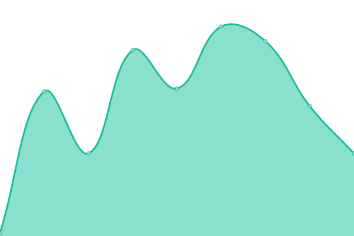 44ms
     
 | 

<a href="https://status.forwardemail.net/history/pop3-forwardemail-net-995-i-pv4">100.00%</a>
    

|  [pop3.forwardemail.net:995 (IPv6)](pop3.forwardemail.net) | 🟩 Up | [pop3-forwardemail-net-995-i-pv6.yml](https://github.com/forwardemail/status.forwardemail.net/commits/HEAD/history/pop3-forwardemail-net-995-i-pv6.yml) | 

 44ms
     
 | 

<a href="https://status.forwardemail.net/history/pop3-forwardemail-net-995-i-pv6">100.00%</a>
    

|  [pop3.forwardemail.net:2995 (IPv4)](pop3.forwardemail.net) | 🟩 Up | [pop3-forwardemail-net-2995-i-pv4.yml](https://github.com/forwardemail/status.forwardemail.net/commits/HEAD/history/pop3-forwardemail-net-2995-i-pv4.yml) | 

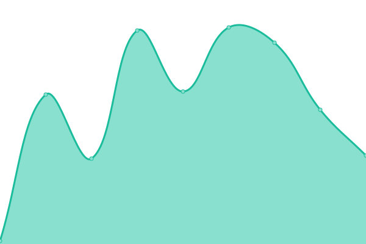 44ms
     
 | 

<a href="https://status.forwardemail.net/history/pop3-forwardemail-net-2995-i-pv4">100.00%</a>
    

|  [pop3.forwardemail.net:2995 (IPv6)](pop3.forwardemail.net) | 🟩 Up | [pop3-forwardemail-net-2995-i-pv6.yml](https://github.com/forwardemail/status.forwardemail.net/commits/HEAD/history/pop3-forwardemail-net-2995-i-pv6.yml) | 

 44ms
     
 | 

<a href="https://status.forwardemail.net/history/pop3-forwardemail-net-2995-i-pv6">100.00%</a>
    

|  [mx1.forwardemail.net:25 (IPv4)](mx1.forwardemail.net) | 🟥 Down | [mx1-forwardemail-net-25-i-pv4.yml](https://github.com/forwardemail/status.forwardemail.net/commits/HEAD/history/mx1-forwardemail-net-25-i-pv4.yml) | 

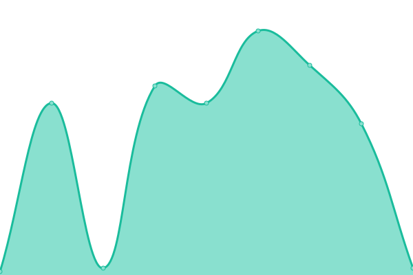 36ms
     
 | 

<a href="https://status.forwardemail.net/history/mx1-forwardemail-net-25-i-pv4">99.99%</a>
    

|  [mx1.forwardemail.net:25 (IPv6)](mx1.forwardemail.net) | 🟥 Down | [mx1-forwardemail-net-25-i-pv6.yml](https://github.com/forwardemail/status.forwardemail.net/commits/HEAD/history/mx1-forwardemail-net-25-i-pv6.yml) | 

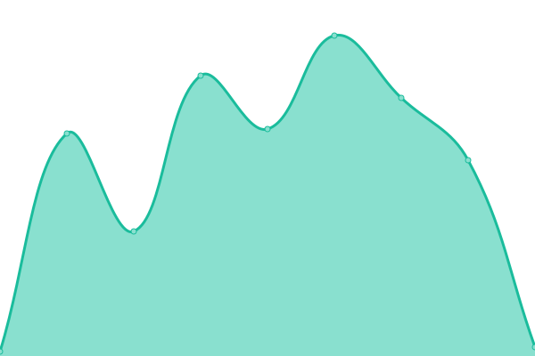 36ms
     
 | 

<a href="https://status.forwardemail.net/history/mx1-forwardemail-net-25-i-pv6">99.99%</a>
    

|  [mx2.forwardemail.net:25 (IPv4)](mx2.forwardemail.net) | 🟥 Down | [mx2-forwardemail-net-25-i-pv4.yml](https://github.com/forwardemail/status.forwardemail.net/commits/HEAD/history/mx2-forwardemail-net-25-i-pv4.yml) | 

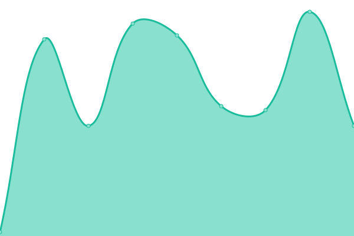 44ms
     
 | 

<a href="https://status.forwardemail.net/history/mx2-forwardemail-net-25-i-pv4">99.99%</a>
    

|  [mx2.forwardemail.net:25 (IPv6)](mx2.forwardemail.net) | 🟥 Down | [mx2-forwardemail-net-25-i-pv6.yml](https://github.com/forwardemail/status.forwardemail.net/commits/HEAD/history/mx2-forwardemail-net-25-i-pv6.yml) | 

 43ms
     
 | 

<a href="https://status.forwardemail.net/history/mx2-forwardemail-net-25-i-pv6">99.99%</a>
    

|  [caldav.forwardemail.net:443 (IPv4)](caldav.forwardemail.net) | 🟩 Up | [caldav-forwardemail-net-443-i-pv4.yml](https://github.com/forwardemail/status.forwardemail.net/commits/HEAD/history/caldav-forwardemail-net-443-i-pv4.yml) | 

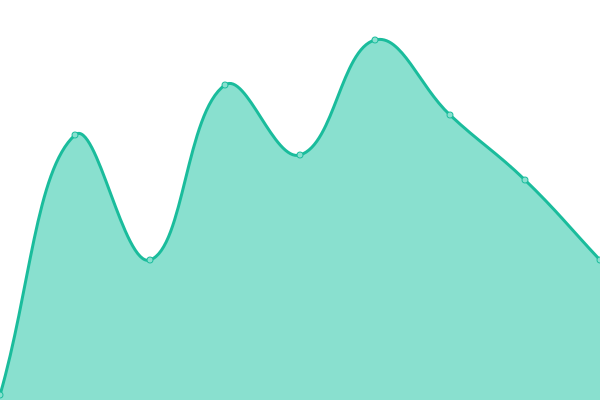 36ms
     
 | 

<a href="https://status.forwardemail.net/history/caldav-forwardemail-net-443-i-pv4">100.00%</a>
    

|  [caldav.forwardemail.net:443 (IPv6)](caldav.forwardemail.net) | 🟩 Up | [caldav-forwardemail-net-443-i-pv6.yml](https://github.com/forwardemail/status.forwardemail.net/commits/HEAD/history/caldav-forwardemail-net-443-i-pv6.yml) | 

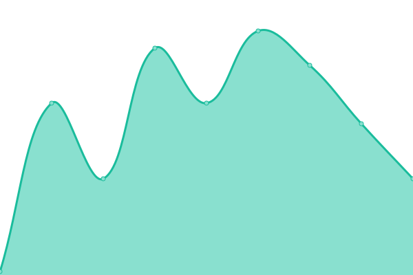 36ms
     
 | 

<a href="https://status.forwardemail.net/history/caldav-forwardemail-net-443-i-pv6">100.00%</a>
    

|  [caldav.forwardemail.net:80 (IPv4)](caldav.forwardemail.net) | 🟩 Up | [caldav-forwardemail-net-80-i-pv4.yml](https://github.com/forwardemail/status.forwardemail.net/commits/HEAD/history/caldav-forwardemail-net-80-i-pv4.yml) | 

 36ms
     
 | 

<a href="https://status.forwardemail.net/history/caldav-forwardemail-net-80-i-pv4">100.00%</a>
    

|  [caldav.forwardemail.net:80 (IPv6)](caldav.forwardemail.net) | 🟩 Up | [caldav-forwardemail-net-80-i-pv6.yml](https://github.com/forwardemail/status.forwardemail.net/commits/HEAD/history/caldav-forwardemail-net-80-i-pv6.yml) | 

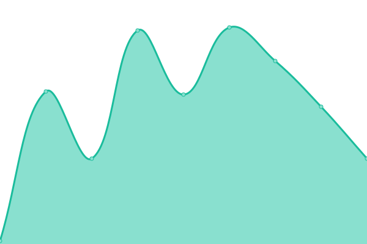 36ms
     
 | 

<a href="https://status.forwardemail.net/history/caldav-forwardemail-net-80-i-pv6">100.00%</a>
    

|  [bree.forwardemail.net](bree.forwardemail.net) | 🟩 Up | [bree-forwardemail-net.yml](https://github.com/forwardemail/status.forwardemail.net/commits/HEAD/history/bree-forwardemail-net.yml) | 

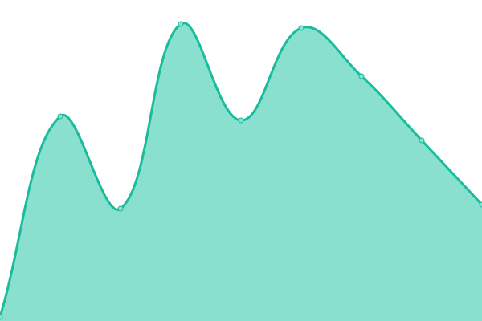 45ms
     
 | 

<a href="https://status.forwardemail.net/history/bree-forwardemail-net">100.00%</a>
    

|  [sqlite.forwardemail.net](sqlite.forwardemail.net) | 🟩 Up | [sqlite-forwardemail-net.yml](https://github.com/forwardemail/status.forwardemail.net/commits/HEAD/history/sqlite-forwardemail-net.yml) | 

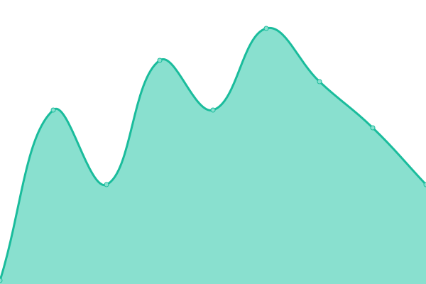 36ms
     
 | 

<a href="https://status.forwardemail.net/history/sqlite-forwardemail-net">100.00%</a>
    

<!--end: status pages-->

[**Visit our status website →**](https://status.forwardemail.net)

## 📄 License

- Powered by: [Upptime](https://github.com/upptime/upptime)
- Code: [MIT](./LICENSE) © [Forward Email - Free, Encrypted, and Open-Source Email Forwarding Service for Custom Domains](https://forwardemail.net)
- Data in the `./history` directory: [Open Database License](https://opendatacommons.org/licenses/odbl/1-0/)
